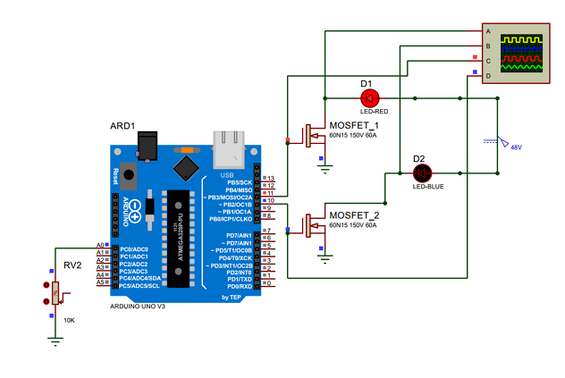
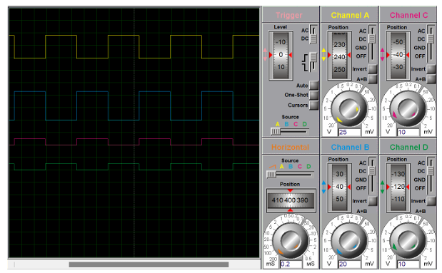
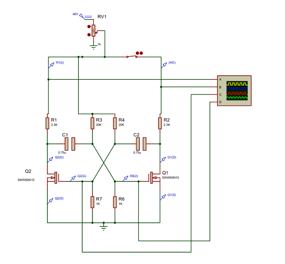
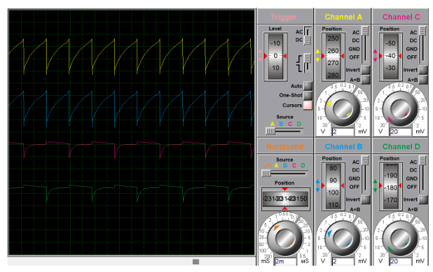

# 1000W Induction Heater Simulation

This repository contains the Proteus simulation files for a 1000W induction heater. The project calculates the required power, coil inductance, and resonant capacitance based on a set of heating specifications.

It then explores two different MOSFET driver circuits to power the induction coil:
1.  **A microcontroller-based driver** using an Arduino UNO.
2.  **An analog driver** using a self-oscillating MOSFET-based astable multivibrator.

***

## Project Goal & Specifications

The primary goal is to design an induction heater capable of heating 1 kg of steel from 50°C to 1000°C in 10 minutes (600 seconds).

### Specifications
* **Workpiece:** 1 kg Steel
* **Specific Heat Capacity (c):** \~500 J/kg°C
* **Initial Temperature:** 50°C
* **Final Temperature:** 1000°C
* **Heating Time (t):** 600s (10 minutes)
* **Desired Resonant Frequency (f):** 50 kHz

### Coil Parameters
* **Coil Diameter (l_coil):** 40 mm (0.04 m)
* **Coil Radius (r):** 20 mm (0.02 m)
* **Number of Turns (N):** 10

***

## 1. Design Calculations

### Power Requirements

**1. Temperature Change (ΔT):**

\[ \Delta T = \text{Final Temperature} - \text{Initial Temperature} \]

\[ \Delta T = 1000°C - 50°C \]

\[ \Delta T = 950°C \]

**2. Heat Energy Required (Q):**

\[ Q = m \cdot c \cdot \Delta T \]

\[ Q = 1~\text{kg} \times 500~\text{J/kg°C} \times 950°C \]

\[ Q = 475,000~\text{J} \]

**3. Ideal Power (P_i):**

\[ P_i = \frac{Q}{t} \]

\[ P_i = \frac{475,000~\text{J}}{600~\text{s}} \]

\[ P_i = 791.67~\text{W} \]

**4. Actual Power (P) (Assuming 80% efficiency η):**

\[ P = \frac{P_i}{\eta} \]

\[ P = \frac{791.67}{0.80} \]

\[ P = 989.59~\text{W} \]

\[ P \approx 1000~\text{W} \]

**5. Supply Selection:**

To achieve ~1000W, a suitable power supply is required.

\[ \text{Current required (I)} = \frac{P}{\text{Voltage}} \]

\[ \text{For 12V: } I = \frac{989.59}{12} = 82.47~\text{A} \]

\[ \text{For 24V: } I = \frac{989.59}{24} = 41.23~\text{A} \]

\[ \text{For 48V: } I = \frac{989.59}{48} = 20.62~\text{A} \]

**Conclusion:** A **48V, 25A power supply** is a safe and appropriate choice.

### Coil & Resonant Tank

**1. Coil Inductance (L):**

Using the standard formula for a short solenoid:

\[ L = \frac{\mu_0 \times N^2 \times A}{l_{\text{coil}}} \]

Where:

\[ A = \pi \times r^2 \]

\[ A = \pi \times (0.02~\text{m})^2 \]

\[ A = 0.001257~\text{m}^2 \]

Calculating inductance:

\[ L = \frac{4\pi \times 10^{-7} \times 10^2 \times 0.001257}{0.04} \]

\[ L = \frac{1.578 \times 10^{-7}}{0.04} \]

\[ L = 3.947 \times 10^{-6}~\text{H} \]

\[ L \approx 3.95~\mu\text{H} \]

**2. Required Capacitance (C):**

To achieve the resonant frequency (f) of 50 kHz with the 3.95 μH coil:

\[ C = \frac{1}{(2\pi f)^2 \times L} \]

\[ C = \frac{1}{(2\pi \times 50 \times 10^3)^2 \times 3.95 \times 10^{-6}} \]

\[ C = \frac{1}{(314,159.27)^2 \times 3.95 \times 10^{-6}} \]

\[ C = \frac{1}{98,696,044,010.89 \times 3.95 \times 10^{-6}} \]

\[ C = \frac{1}{389,849.37} \]

\[ C = 2.565 \times 10^{-6}~\text{F} \]

\[ C \approx 2.57~\mu\text{F} \]

### Heat Sink Design

**1. MOSFET Power Dissipation (P_D):**

Using a worst-case current I_D of **25 A** (the max rating of the chosen power supply) and the SNW60N15 MOSFET (R_DS(on) = 33 mΩ):

\[ P_D = I_D^2 \times R_{DS(on)} \]

\[ P_D = (25)^2 \times 33 \times 10^{-3} \]

\[ P_D = 625 \times 0.033 \]

\[ P_D = 20.625~\text{W} \]

**2. Required Thermal Resistance (R_θSA):**

Assuming T_Jmax = 150°C and T_A = 25°C:

\[ R_{\theta SA} = \frac{T_{Jmax} - T_A}{P_D} - R_{\theta JC} - R_{\theta CS} \]

\[ R_{\theta SA} = \frac{150 - 25}{20.625} - 0.45 - 0.25 \]

\[ R_{\theta SA} = \frac{125}{20.625} - 0.7 \]

\[ R_{\theta SA} = 6.0606 - 0.7 \]

\[ R_{\theta SA} = 5.3606°\text{C/W} \]

\[ R_{\theta SA} \approx 5.36°\text{C/W} \]

**Conclusion:** The heat sink must have a thermal resistance **less than or equal to 5.36°C/W**.

***

## 2. Circuit Design 1: Arduino Driver

This design uses an Arduino UNO to generate alternating PWM signals to drive two MOSFETs in a half-bridge configuration.

### Components
* Arduino UNO
* MOSFET (60N15) × 2
* Potentiometer (10K Ω) × 1
* 48V 25A Power Supply

### Control Logic & Code

The potentiometer on pin `A0` is used to control the period of the PWM signal. The code maps the analog value (0-1023) to a period from 17ms to 1000ms (a frequency range of ~1Hz to 60Hz). The two MOSFETs are driven in an alternating fashion.

```cpp
const int pwmPinA = 11;
const int pwmPinB = 10;
const int potPin = A0;

void setup() {
  pinMode(pwmPinA, OUTPUT);
  pinMode(pwmPinB, OUTPUT);
  pinMode(potPin, INPUT);
}

void loop() {
  int potValue = analogRead(potPin);  // to read the potentiometer
  // Map pot value (0-1023) to a period from 1000ms (1Hz) to 17ms (~60Hz)
  long period = map(potValue, 0, 1023, 1000, 17);
  long halfPeriod = period / 2;

  digitalWrite(pwmPinA, HIGH);
  digitalWrite(pwmPinB, LOW);
  delay(halfPeriod);

  digitalWrite(pwmPinA, LOW);
  digitalWrite(pwmPinB, HIGH);
  delay(halfPeriod);
}
```

### Simulation

**File:** `Arduino_Simulation.pdsprj`

The simulation file was modified to test the driver logic. The induction coil and capacitor were replaced with LEDs, as Proteus had issues simulating the full LC tank.



The oscilloscope results show the two gate signals (Channels C, D) and the resulting alternating square wave outputs at the drains of the two MOSFETs (Channels A, B).



***

## 3. Circuit Design 2: Astable Multivibrator

This design uses a MOSFET-based astable multivibrator to create a self-oscillating circuit, removing the need for a microcontroller.

### Design Note & Calculation

The project specification calls for a 50 **kHz** resonant frequency, but the astable multivibrator calculation was performed for 50-200 **Hz**.

The calculation shown is for **50 Hz**. Using the **20k Ω** resistors (as shown in the diagram and component list):

**Formula:**

\[ f = \frac{1}{\ln(2) \times (R_1C_1 + R_2C_2)} \]

For symmetric design where R_1 = R_2 = R and C_1 = C_2 = C:

\[ f = \frac{1}{\ln(2) \times 2RC} \]

**Calculation:**

\[ 50 = \frac{1}{0.693 \times 2 \times 20 \times 10^3 \times C} \]

\[ 50 = \frac{1}{0.693 \times 40 \times 10^3 \times C} \]

\[ 50 = \frac{1}{27,720 \times C} \]

\[ C = \frac{1}{50 \times 27,720} \]

\[ C = \frac{1}{1,386,000} \]

\[ C = 0.721 \times 10^{-6}~\text{F} \]

\[ C = 0.721~\mu\text{F} \]

**Selected Component:** A **0.75 μF** capacitor was selected for the astable timing.

### Components
* Astable Capacitors (0.75μF) × 2
* MOSFET (60N15) × 2
* Resistors:
    * 2.3 KΩ × 2
    * 20 KΩ × 2
    * 1 KΩ × 2 (R6, R7)
* Potentiometer (1K Ω) × 1
* 48V 25A Power Supply

### Simulation

**File:** `Astable_Multivibrator_Simulation.pdsprj`

Similar to the Arduino design, the simulation file was modified to test the core oscillator logic. The heater coil, tank capacitor, and choke inductors were removed, as they prevented the simulation from running correctly.



The oscilloscope results show the characteristic charging/discharging "sawtooth" wave of the astable multivibrator at the MOSFET gates, confirming the circuit is oscillating.



***

## Simulation Notes

In both designs, the main load (the resonant LC tank) was removed for simulation purposes. The simulation software (Proteus) failed to run the simulation with the heater coil and capacitor connected. The circuits provided in the simulation files are therefore modified to only test and validate the **driver logic** of the MOSFETs.

***

## Repository Structure

```
.
├── README.md
├── Arduino_Simulation.pdsprj
├── Astable_Multivibrator_Simulation.pdsprj
└── images/
    ├── arduino_simulation_circuit.png
    ├── arduino_simulation_results.png
    ├── astable_simulation_circuit.png
    └── astable_simulation_results.png
```

